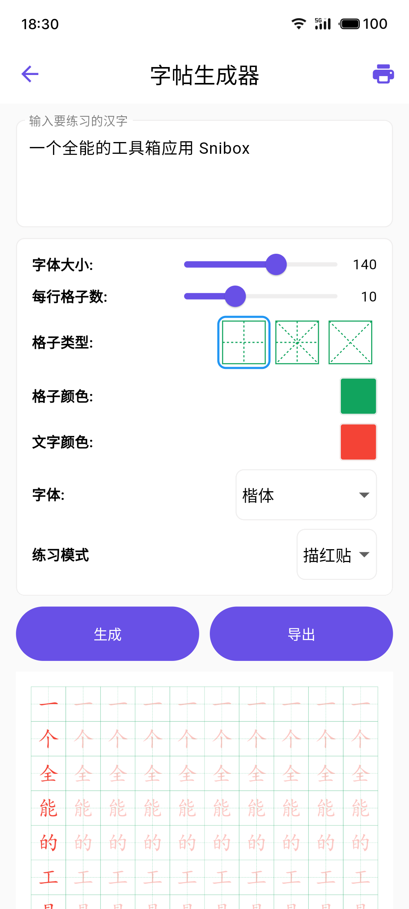
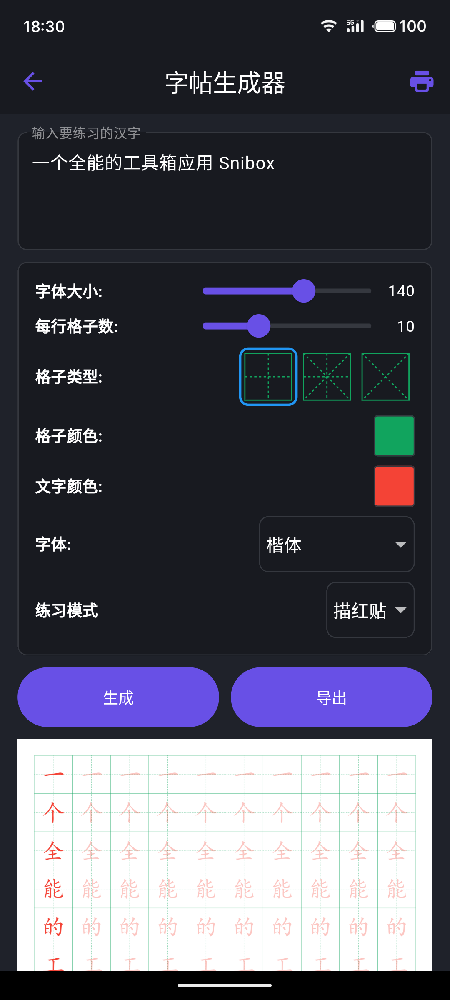

<div align="center">
    <h2>📢 推荐应用</h2>
    <p>汉字字帖生成器 是 Snibox 多功能工具箱中的一个功能。</p>
    <p>想体验更多实用工具吗？下载 Snibox，全面提升你的生产力！</p>
    <div align="center">
    
    <h1 style="border-bottom: none;">Snibox</h1>
   </div>
    <a href="https://apps.apple.com/zh/app/id6572311811">
        
    </a>
</div>

# 汉字字帖生成器

汉字字帖生成器是一款基于Flutter开发的应用，旨在帮助用户轻松创建自定义的汉字练习字帖。无论是学习汉字的初学者，还是想要提高书法技能的爱好者，都能从这个工具中受益。

### Screenshots

<table>
  <tr>
    <td></td>
    <td></td>
  </tr>
</table>

## 功能特点

- 支持自定义文本输入
- 多种格子类型选择（标准格、田字格、米字格）
- 可调节字体大小和每行格子数
- 支持自定义字体颜色
- 两种练习模式：描红模式和文章模式
- 支持自定义字体导入
- 生成高质量PDF文件，方便打印
- 响应式设计，支持多种设备

## 如何使用

1. 在文本框中输入要练习的汉字。
2. 调整设置，包括字体大小、格子类型、颜色等。
3. 选择练习模式（描红模式或文章模式）。
4. 点击"生成"按钮创建字帖。
5. 使用"导出"功能将字帖保存为PDF文件。
6. 可以直接使用"打印"功能打印字帖。

## 开始使用

### 先决条件

- Flutter SDK
- Dart SDK
- Android Studio 或 VS Code（安装Flutter插件）

### 安装步骤

1. 克隆仓库：
   ```
   git clone https://github.com/aidevjoe/Chinese-Copybook-Generator.git
   ```
2. 进入项目目录：
   ```
   cd Chinese-Copybook-Generator
   ```
3. 获取依赖：
   ```
   flutter pub get
   ```
4. 运行应用：
   ```
   flutter run
   ```

## 依赖库

- `file_picker`: 用于选择自定义字体文件
- `multi_split_view`: 用于创建分割视图布局
- `pdf`: 用于生成PDF文件
- `printing`: 用于打印功能
- `document_file_save_plus`: 用于保存生成的PDF文件

## 许可证

本项目采用 MIT 许可证。详情请见 `LICENSE` 文件。